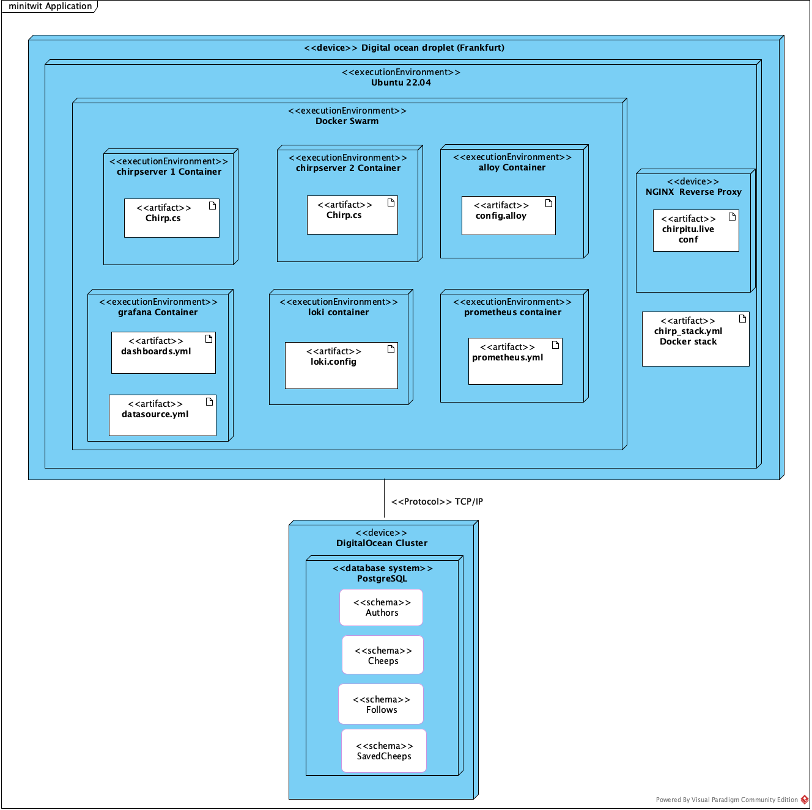
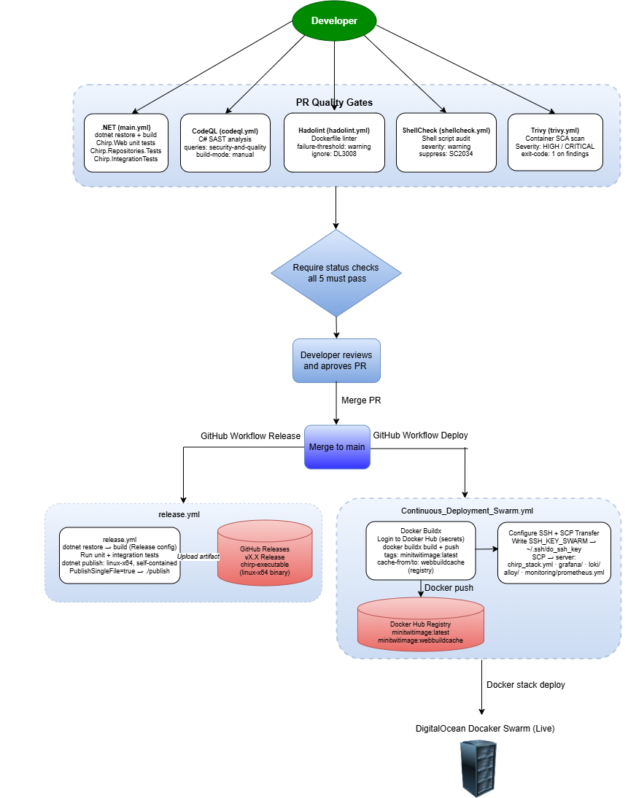
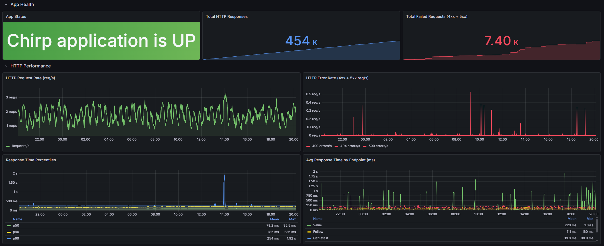
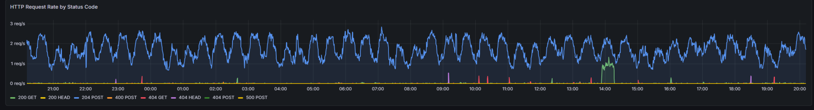
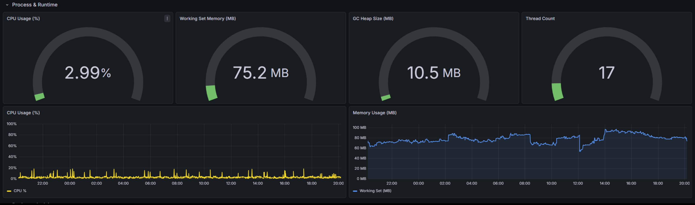
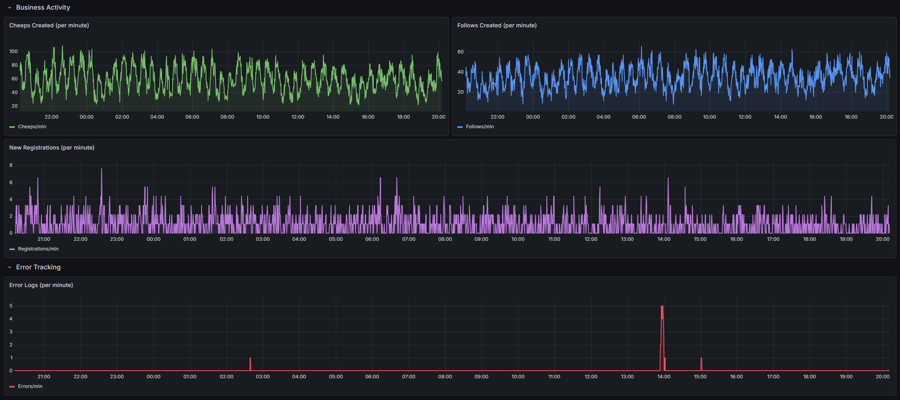
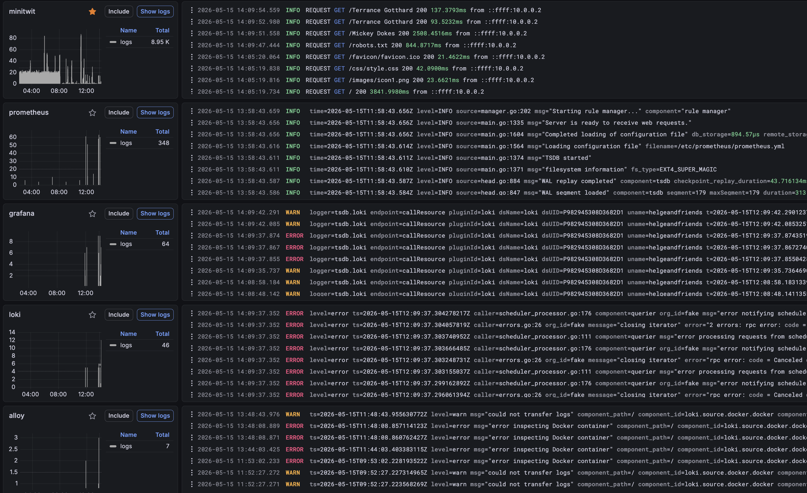

# System's Perspective
## Design and Architecture
<!-- Author(s): Bondo -->

TODO: Design and architecture of your ITU-MiniTwit systems.

## Dependencies
<!-- Author(s): Jacob F -->
The Chirp application is built on .NET 9.0 with ASP.NET Core (Razor Pages). Entity Framework Core 9.0 is used as the ORM, backed by PostgreSQL 17 in production and SQLite for local development. Authentication is     
handled by ASP.NET Identity for local accounts and GitHub OAuth for third-party login.

The application runs in a Docker container (runtime image aspnet:9.0-noble-chiseled) and is deployed as a Docker Swarm stack on a DigitalOcean Droplet. Infrastructure is provisioned with Terraform, including a       
managed PostgreSQL cluster and a reserved IP. The observability stack consists of Prometheus for metrics, Grafana Alloy for log collection, Loki for log storage, and Grafana for visualization.

CI/CD is handled by GitHub Actions. Pipelines cover building, testing, and deploying to Docker Swarm via Docker Hub. Security tooling includes CodeQL for static analysis, Trivy for container image scanning, Hadolint
for Dockerfile linting, and ShellCheck for shell script linting. The report itself is built from Markdown to PDF using Pandoc.

Testing uses xUnit and NUnit for unit and integration tests, Coverlet for code coverage, and Playwright for end-to-end browser testing.
## Current State of the System
<!-- Author(s): Emilie -->
TODO: Describe the current state of your systems, for example using results of static analysis and quality assessments.

# Process' Perspective
TOBEDELETED: This perspective should clarify how code or other artifacts come from idea into the running system and everything that happens on the way.

## CI/CD Chains
<!-- Author(s): Emilie -->

TODO: A complete description and illustration of stages and tools included in the CI/CD pipelines, including deployment and release of your systems.

## Monitoring
Our Chirp application's monitoring stack consists of Prometheus, Grafana, Loki and Grafana Alloy. These are deployed as
services within the Docker Swarm. All configuration regarding the monitoring stack is stored as code and updated
automatically on every push to main via the Continuous_Deployment_Swarm.yml workflow. 
 
Following the Turnbull's
"The Art of Monitoring", our monitoring setup sits between the reactive and proactive level, leaning more towards the 
proactive level. The instrumentation is fully automated and code-driven, with metrics covering both application 
performance and business outcomes. However, the absence of active alerting means the dashboards are checked reactively 
rather than triggering automatic responses. 
 
The application is set up for whitebox monitoring. It exposes a /metrics endpoint from which Prometheus pulls data every
five seconds. Custom metrics include HTTP request counts and response durations, CPU load, working memory and
business-level counters.
 
The Grafana dashboard is organized into four sections, explained in the following pictures:

**App Health and HTTP Performance** is the primary operational view, that shows live app status. It includes panels for
HTTP request rates per second and HTTP error rates second, broken down by 4xx and 5xx status codes, which gives
visibility into the distribution of load and faults. Response time percentiles (p50, p90, p99) and per-endpoint average 
latency reflect the principle of monitoring close to the user, which allows for assessment of the user experience. 

**Process & Runtime**
The process and runtime section shows CPU Usage, working set memory, garbage collection heap size and thread count as gauges, where CPU 
usage and working set memory are also shown as a graph over time, to correlate the behaviour of the application to the 
resource consumption. 

**Business Activity and Error Tracking** 
The business activity section extends the monitoring beyond the infrastructure. Cheeps created, follows and new 
registrations per minute are tracked as graphs, providing a business-level overview of the system, which would be useful
in a real-world scenario. Error log volume is sourced from loki, and shows a visual overview of application exceptions 
without having to manually inspect the logs. 

## Logging
<!-- Author(s): Jacob F-->
Logs are collected, stored, and visualised using a three-component stack: 
**Grafana Alloy**, **Loki**, and **Grafana**. 
Alloy runs as a container on the droplet with access to the Docker socket. 
It reads the stdout and stderr streams of every running container, applies a processing pipeline, and forwards the results to Loki. 
Loki stores and indexes the logs for a preservation period of seven days. 
Grafana then queries Loki as a datasource, 
making the logs accessible for search and exploration under *Drilldown / Logs*.

### Log Collection with Alloy
Alloy queries the Docker socket to discover running containers and their log file locations. 
Its processing pipeline maps container names to a `service_name` label so both Swarm replicas become `minitwit`. 
It then parses the JSON from `minitwit` logs, promoting `LogLevel` to a Loki label for filtering.

### What the Application Logs
The application emits structured JSON logs to stdout via .NET's `AddJsonConsole`. 
Each HTTP request produces a log entry with method, path, status code, duration, and remote IP. 
Authentication events (login, registration, account deletion) are logged by the ASP.NET Identity pages, 
and unhandled exceptions produce stack traces on stderr, which are both captured by Alloy.

### Log Aggregation in Docker Swarm
Because the application runs as two Swarm replicas, both containers emit independent log streams. 
In Loki these streams are queryable in two ways: filtering by `service_name=minitwit` which returns the combined log stream from both replicas or
 filtering by the `container` label (e.g. `chirp_chirpserver.2.*`) that isolates a single replica. 
This allows both an aggregated view of all application traffic and per-replica investigation when needed.

## Security Assessment
<!-- Author(s): Joakim -->
Our application utilizes an automated CI/CD pipeline to continuously harden the system and
ensure vulnerabilities are not introduced during development.

The pipeline uses four Automated Quality Gates CodeQL, Trivy, Hadolint and shellcheck.

**CodeQL** - our SAST tool, which notified the developers about a vulnerability to Cross-Site Scripting (XSS) attacks 
caused by unsanitized user input in Request.Query["search"]. This vulnerability was patched by applying System.Net.WebUtility.HtmlEncode() 
to ensure the input is treated as plain text rather than exceutable code. 

**Trivy** - our Software Composition Analysis (SCA) tool and vulnerability scanner. Initial scans of our standard Docker base images revealed an unnecessarily large attack surface.
To mitigate this, we transitioned to the minimal aspnet:9.0-noble-chiseled base image, which removes standard OS utilities (like bash)
to restrict attacker mobility. Trivy now acts as a strict quality gate by enforcing an --exit-code 1 policy, blocking deployments if any high or critical vulnerabilities are detected.

**Hadolint** - our Dockerfile linter. It continuously audits our container configurations to enforce best practices, 
such as ensuring the application runs exclusively as the non-root app user. To enforce these standards over time, it is integrated into our pipeline as a strict checkpoint that fails the build if any warnings occur.

**ShellCheck** - our shell script linter. It acts as an automated quality safeguard by scanning our deployment scripts for syntax errors, deprecated commands, and security flaws 
like injection vulnerabilities. This guarantees that our infrastructure-as-code is both secure and reliable prior to deployment.

## Availability and Scaling
<!-- Author(s): Bondo -->
TODO: How do you handle availability and scaling in your systems?

Our application runs on a single DigitalOcean droplet using Docker Swarm, which orchestrates two replicas of our Chirp container, each capped at 200 MB of memory. Swarm's built-in load balancer distributes incoming requests evenly across both replicas, and all services are configured with restart_policy: on-failure, so the swarm manager automatically restarts any failed container. A DigitalOcean reserved IP is assigned to the droplet via Terraform, ensuring a stable endpoint even if the underlying VM is replaced.

We have applied both vertical and horizontal scaling. We vertically scaled our managed PostgreSQL cluster by upgrading from 1 GB to 2 GB of RAM, which improved query performance. We horizontally scaled the application layer by moving from a single container to two Swarm replicas. The entire infrastructure — droplet, database cluster, firewall rules, and reserved IP is defined in Terraform and can be reproduced from scratch with a single terraform apply.

The main limitation is single points of failure: we rely on one droplet and one database node. Adding a database replica would be the highest-value improvement, both for data redundancy and because the database is the primary performance bottleneck.

# Reflection Perspective
TOBEDELETED: Describe the biggest issues, how you solved them, and which are major lessons learned with regards to:

## Evolution and Refactoring
<!-- Author(s): Emilie og Joakim -->
TODO: Describe the biggest issues, interactions, and bugs during the project.
NOTE: convert from old chirp to new thing with API
NOTE: Migration to postgres

## operation
<!-- Author(s): Bondo -->
TODO: From docker compose to terraform and docker swarm.

## maintenance
<!-- Author(s): Jacob eller Jacob -->
TODO: 

# Use of generative AI
<!-- Author(s): Joakim  -->
It was agreed upon that the group would follow ITU's guidelines regardign the use of LLMs during the development 
of the project this means that whenever an LLM in our case Claude has generated code it should be credited in the commit.  

Both claud and gemini have also been used for debugging and for explaining abstract concepts if needed during development  

## References
<!-- Link all artifacts: repositories, issue trackers, monitoring/logging systems, etc. -->

- **Repository:** <https://github.com/Joakim-David/GruppeOG>
- **Minitwit URL:** <https://chirpitu.live>
- **Monitoring:** Grafana at `http://209.38.190.12:3000`
- **Issue Tracker:** <https://github.com/Joakim-David/GruppeOG/issues>
